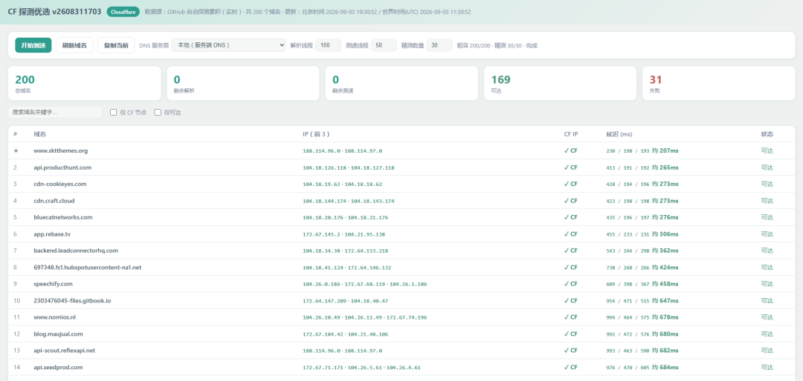

# CF 探测优选（CF-PROBE-SELECT）

自动挖掘走 Cloudflare 的第三方站点，并在网页端实时测速，帮你挑出最快的节点。

## 功能

- **探测**：GitHub Actions 定时顺着网页外链自动发现走 Cloudflare CDN 的域名，累积写入 `cf_domains.txt`。
- **测速**：Cloudflare Worker 提供网页，在你的浏览器侧对每个域名实时测速。
- **优选**：按成功率与延迟动态排序，自行复制并使用最快的节点。

## 测速网页

测速全部在你的浏览器侧完成，真实反映你到各节点的延迟。



#### 两阶段测速

1. **粗筛**：全量域名各测 **1 轮**，得到完整排序；
2. **精测**：仅对粗筛里延迟最低的 **精测数量** 个域名测 **3 轮**（间隔 2 秒）取平均。

页面顶部可调参数：

| 参数 | 默认值 | 范围 | 说明 |
|---|---|---|---|
| 精测数量 | 50 | 1–400 | 粗筛后进入精测的域名数 |
| 解析并发 | 16 | 1–32 | DNS 解析并发数 |
| 测速并发 | 10 | 1–32 | HTTPS 测速并发数 |
| DNS 服务商 | 本地 | — | 可选本地 / 阿里 / DNS.SB / CF Gateway / Google / 自定义 |

设置会自动保存到 `localStorage`。

#### 结果展示

- 延迟列显示每轮成绩（数字 = 毫秒，`T` = 超时，`E` = 失败）与平均值；
- 鼠标悬停可看该行是「粗筛 1 轮」还是「精测 3 轮」；
- 排序：精测结果优先 → 成功率降序 → 平均延迟升序；
- 表头（域名 / IP / CF 判定 / 延迟 / 状态）均可点击切换排序。

#### 筛选与复制

- 按域名关键字搜索，并勾选「仅 CF 节点」「仅可达」；
- 筛选只影响表格显示，顶部指标卡始终统计全量；
- 点击「复制当前」可复制当前筛选后可见的域名（附平均延迟）。

#### 失效判定

- **非 CF 节点跳过测速**：解析出的 IP 只要有一个不在 Cloudflare 网段，即标记为「非CF，跳过测速」，不再发起 HTTPS 测速；
- 失败原因区分：「解析失败」「非CF，跳过测速」「测速失败」三种提示；
- 开始测速前统一预检所选 DNS，不可用时弹窗提示。

#### 数据来源

- 每个域名解析前 3 个 A 记录 IP，用 Cloudflare 官方 IPv4 CIDR 判定是否落在 CF 段；
- CF 判定按 30 个 IP 攒批发送；
- 域名列表由 Worker 从 GitHub raw 拉取，带 120 秒缓存，「刷新域名」按钮可手动重新拉取。

### 域名列表地址

网页从 `RAW_DOMAINS_URL` 指定的地址拉取 `cf_domains.txt`：
- 优先读取 `wrangler.toml` 的 `[vars] RAW_DOMAINS_URL`；
- 未配置时回退代码内默认值；
- fork 后 GitHub Actions 自动把该地址改写为当前仓库地址并提交。

本地预览：`wrangler dev`（仓库根目录运行，根目录已有 `wrangler.toml`）。
部署：`wrangler deploy`，或在 Cloudflare Dashboard 连接本仓库的 Git 自动部署。

## 探测脚本

由 GitHub Actions 定时运行（每天 UTC 06:30，约北京时间 14:30；也可在 Actions 页面手动 `workflow_dispatch` 触发），广度优先爬取外链、累积走 Cloudflare 的域名。同一工作流并发时只跑一个实例，避免并行覆盖 `cf_domains.txt`。

### 本地手动运行

```bash
pip install -r requirements.txt
python cf_probe_select.py
```

- 探测阶段：单源系统 DNS + CF IP 段硬过滤（不认 Server 头）。
- 落盘前：6 套 DoH（系统 / 腾讯 / 阿里 / DNS.SB / Cloudflare Gateway / Google）校验。
  判定规则：**解析失败的源直接忽略**，只有「成功解析的源」里出现非 CF IP 才剔除该域名；所有源都解析失败则视为域名失效并删除。
- 同一主域名最多保留 3 个子域名。
- 总量上限 200：超出时主域配额从 3 依次收紧到 2、1；仍超限则在 Actions 内按「GitHub 机房 → CF 节点」延迟升序保留最快前 200（不可达沉底）。

### 入库拦截（黑名单）

探测每个候选域名时，依次做四道判定，命中任意一条即「仅扩散外链、不入库」——该域名仍作为发现新域名的跳板去爬它的外链，但不会写入 `cf_domains.txt`：

- **巨型站**：根域属于 Big Tech（不入库，避免无意义地收录大厂站点）。
- **黑产域名**：命中 Hagezi 黑名单（3 份：`gambling` / `tif` / `fake` onlydomains，运行前从 jsDelivr / GitHub 拉取）。
- **黑产关键词**：命中 `blacklist_keywords.txt` 自建关键词黑名单（子串 / 边界匹配）。
- **T5 风险域名**：子域前缀为 `staging` / `test` / `dev` / `demo` / `sandbox` / `preview` / `temp`，或域名含 8 位以上纯数字 / 哈希串。

每次运行还会对已有列表再清洗一遍，剔除已落入上述黑名单的域名。

`cf_domains.txt` 每行一个纯域名，由脚本自动维护，请勿手动编辑。文件头部含更新时间（北京时间与世界时间 UTC）。

### 可调参数

所有可调参数集中在 `cf_probe_select.py` **文件头部的「可调参数配置区」**。

| 参数 | 默认值 | 说明 |
|---|---|---|
| `OUTPUT_FILE` | `cf_domains.txt` | 探测结果落盘文件名 |
| `BOOTSTRAP_SEEDS` | `["cloudflare.com"]` | 历史为空时的自举种子 |
| `SEED_SAMPLE_SIZE` | `5` | 每轮从已有域名中随机抽取的种子数量 |
| `MAX_SUBDOMAINS_PER_ROOT` | `3` | 同一主域名最多保留的子域数量 |
| `MAX_NEW_PER_RUN` | `200` | 单轮最多新增的域名数（达到即提前结束） |
| `TOTAL_CAP` | `200` | 落盘域名总量硬上限；超限先收紧主域配额，仍超限则按延迟截断 |
| `PROBE_TIME_LIMIT` | `600` | 单轮探测时长上限（秒） |
| `MAX_NEW_PER_PAGE` | `50` | 单个页面最多提取的外链域名数 |
| `BATCH_SIZE` | `20` | 每轮出队处理的域名数 |
| `WORKERS_PROBE` | `10` | 主探测（检测 + 外链扩散）并发数 |
| `WORKERS_VERIFY` | `10` | 落盘前 CF 多源校验并发数 |
| `WORKERS_LATENCY` | `10` | Actions 内部延迟测速并发数 |
| `LATENCY_TIMEOUT` | `3` | Actions 内部测速单域名超时（秒） |
| `HTTP_TIMEOUT_EXPAND` | `6` | 抓取页面提取外链的超时（秒） |
| `DNS_TIMEOUT_UDP` | `5` | UDP DNS 解析超时（秒） |
| `DNS_TIMEOUT_DOH` | `5` | DoH 解析超时（秒） |
| `CF_RANGES_TIMEOUT` | `10` | 拉取 Cloudflare 官方 IP 段的超时（秒） |
| `GATEWAY_SUB_LEN` | `10` | Cloudflare Gateway DoH 随机子域长度 |

> **调参提示**
> - 调大 `TOTAL_CAP` 能让列表更全，但网页端测速耗时会随之线性增加。
> - 调大 `WORKERS_*` 可加快探测，但过高可能触发目标站限流或被 GitHub Actions 网络限速。
> - 调小 `PROBE_TIME_LIMIT` 可缩短单次运行时长，但每轮发现的新域名会变少。

## 文件结构

| 文件 / 目录 | 作用 |
|---|---|
| `cf_probe_select.py` | 探测主脚本（GitHub Actions 定时运行） |
| `requirements.txt` | 探测脚本的 Python 依赖 |
| `blacklist_keywords.txt` | 自建关键词黑名单（命中则仅扩散外链、不入库） |
| `cf_domains.txt` | 探测累积的域名列表（自动维护，勿手编） |
| `worker/worker.js` | Cloudflare Worker 入口（托管前端页面 + 接口、拉取域名列表） |
| `worker/page.js` | 前端测速逻辑（解析、CF 判定、两阶段测速、排序渲染） |
| `wrangler.toml` | Worker 部署配置（根目录） |
| `.github/workflows/` | 定时探测工作流（GitHub Actions） |
| `assets/` | README 截图等静态资源 |
| `LICENSE` | 开源协议 |
